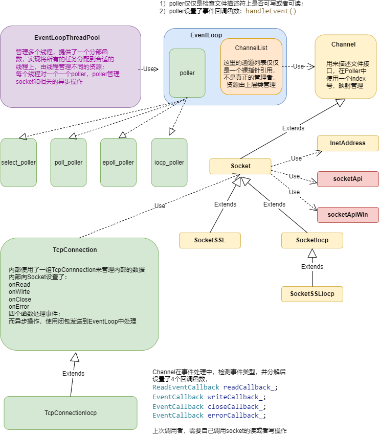

# LibNet库说明

## 一、设计目的
用c++11写一个轻量级跨平台（windows，linux, mac )的高性能网络库，用于高速的rpc调用；
grpc和brpc对于小型应用还是太笨重了，而且brpc不跨平台；之前用过libuv二次开发做rpc调用，但是毕竟还是需要一个外部库，这个库希望以源码形式全部集成到项目中；


## 二、参考与引用
在设计思路与原理上参考了其他的一些库：
1. muduo ： 陈硕写的linux异步库，缺点是使用了boost，而且不支持其他平台；
2. zsummerX：  log4z的作者发布的源码；
3. libuv：nodejs底层库；
   

集成的第三方源码：
1. log4z : 做了部分更改；
2. log4cpp: 目前只有包装器，可以通过配置启动该模块；
3. uvcpp的日志部分；
4. http_parser: nodejs中早期的解析器，我测试对比了LLHTTP解析器，并没有发现新版的更快，所以还是使用http_parser；


## 三、总体设计

**结构如下图所示**：




整个库的基础结构是构建一个线程池的基础上，所有的上层的socket业务都工作在某个线程中，也就是某个socket在诞生之初，就分配给一个线程，（分配算法可以通过线程池分配函数控制）这样设计的好处是：

1）每个线程一个loop循环，每个循环使用一个select，或者epoll，避免模型本身的一些问题；比如惊群以及select数组限制；

2)  在loop内的线程的socket都在线程上工作，不需要考虑线程安全问题；（个别用户异步命令需要投递到线程上处理，类似libuv）;

3）单个循环上socket的操作不进行线程切换，减少线程切换的代价；


适用场景：

1）单个任务处理时间短，非CPU密集型操作，如果是属于CPU密集型计算，则需要单独添加计算任务管理部分，将任务放到单独的线程池中计算；

2）目前编写了Http Client作为示例，实现http1.1的客户端基本功能，包括：同步、异步、流水线方式访问服务端，同时对部分模型（除了IOCP）使用openssl支持https


## 四、使用示例

### 4.1 TcpConnection使用

见 /test/testTcpConn.cpp 示例如何使用tcp客户端，

实现了发送http请求，等待服务器响应并关闭连接；

备注：http协议，对于Apache服务器host字段必须的，其他字段可有可无；另外有些服务器限制更加宽松；

```c++
static std::atomic<bool> bExit{ false };
TcpConnectionPtr  conn = nullptr;
std::string content;
char buffer[4096];
void onClose(const TcpConnectionPtr& connection)
{
	printf("server close socket\n");
	conn = nullptr;
	bExit = true;
}

void onAllocBuffer(const TcpConnectionPtr &conn, char * *data, size_t *sz, void **pVoid)
{
	*data = buffer;
	*sz = 4096;
	*pVoid = nullptr;
}

void onReadData(const TcpConnectionPtr &conn, char * data, size_t sz, void *pVoid)
{
    printf("recv:%zu, \n %s \n", sz, data);
}

void onWriteEnd(const TcpConnectionPtr &conn, const char * data, size_t sz, void *pVoid, int status)
{
	printf("send %zu \n", sz);
}

int main(int argc, char *argv[])
{
	// 线程池设置为1
	LibNet::EventLoopThreadPool::instance().Init(1).start();

    string ip = "10.128.6.129";
	int port = 80;
	conn = std::make_shared<TcpConnection>(ip, 80);
	conn->setClientCallback(onAllocBuffer, onReadData, onWriteEnd, onClose);

	std::cout << "start to connect:" << ip << ":" <<port << endl;
	bool ret = conn->connectSyn(3);

	if (ret == false)
	{
		printf("connect error\n");
		bExit = true;
	}
	else
	{
		printf("connect ok\n");
	}

	//Utils::sleepFor(2000);
	content =
		"GET /1.html HTTP/1.1\r\n"
		"Host: 127.0.0.1\r\n"
		"Connection: close\r\n"
		"Content-Type: text/html\r\n"
		"\r\n";

	conn->send(content.c_str(), content.length(), 0);
	
	while (!bExit)
	{
		Utils::sleepFor(1000);
	}

	conn = nullptr;
	LibNet::EventLoopThreadPool::instance().stop();

	return 0;
}
```

说明：

在OnRead回调之前，之所以有一个OnAlloc回调，是参考libuv的设计思路，给一个机会让用户自己管理内存，并且减少内存反复拷贝的次数；如果用户设置为空指针，则TcpConnection会还是使用内部的Buffer类管理读内存；这个类是陈硕写的，我做了少量更改；这个Buffer类精巧的地方就是头部预留部分字节用于填充协议头部，方便解析；

### 4.2 同步使用http client

见 test/testClientSyn.cpp 

同步方式使用http目录下的http客户端访问服务：

```c++
string body = R"({ "age": 5 })";

void testSynGet()
{
	LibNet::EventLoopThreadPool::instance().Init(1).start();

	string ip = "127.0.0.1";
    int port = 80;
	HttpClient httpClient(ip, port);
    // open ssl, open https://127.0.0.1:443/1.html
    //httpClient.setHttpsMode();
    
    httpClient.setCmdTimeout(5);

	int count = 0;
	int N = 300;
    char path[260];
	for (int i = 0; i < N; i++)
	{		
        snprintf(path, 260, "/test1.php?id=%d", i + 1);
		int64_t id = httpClient.Get(path);
		if (id > 0)
		{
			printf("id = %lld, code = %d, body = {%s} \n",
				id, 
				httpClient.getResponse()->code,
				httpClient.getResponse()->body.c_str());
		}
		else
		{
			int err = httpClient.getLastErr();
			if (err == Error::Unreachable)
			{
				N = i;
				printf("id = %d cant'connect host= %s:%d, exit here \n",
					i+1, ip.c_str(), port);
				break;
			}
			else if (err == Error::Timeout)
			{
				printf("id = %d timeout\n", i + 1);
			}
			else
			{
				printf("id = %d err = %d\n", i + 1, err);
			}
		}
	}

	httpClient.closeConnection();
	LibNet::EventLoopThreadPool::instance().stop();
}
```


### 4.3 异步使用http client

见 test/testClientSpeedAsyn.cpp

异步方式使用http目录下的http客户端访问服务：

目前没有实现服务端，apache满足不了需求，使用了go的服务端，见tools目录；

### 4.4 流水线方式使用http client

见 test/testClientSpeedPipeLine.cpp

流水线方式使用http目录下的http客户端访问服务：

目前没有实现服务端，使用了go的服务端，见tools目录；


### 4.5 部分性能测试

对于目前我的需求来说，异步方式已经强于cpp_httplib和curl异步方式（https://github.com/robinfoxnan/HttpClientCurl）；

流水线方式可以避免网络时延对调用POST或者GET的性能影响，curl目前的版本似乎并不再支持此选项；

我使用的测试环境为DELL笔记本，window10 pro，vmware开ubuntu18.04, 4核i7-11,16G RAM

测试一、在windows上开启go的http server， 从ubuntu发起1K数据包请求，ping时延0.5ms,

使用select模型，测试结果如下：

| 参数         | 异步rps | 流水线(pipelining)   rps |
| ------------ | ------- | ------------------------ |
| 1线程，1连接 | 2.5k    | 2.1w                     |
| 3线程，3连接 | 1.1w    | 4.8w                     |
| 3线程，9连接 | 2.1w    | 6.7w                     |


后续做了其他相关测试，测试结果发现：

Select模型比EPoll和Poll快；

Select模型比IOCP快；

确实十分惊讶，经过网络信息也印证了实验结果，对于少量的socket连接（1~10），select模型更加简单，需要管理的socket列表不需要系统调用即可实现；而epoll和IOCP明显动作更多；IOCP尤其是每次调用明明可以一次完成确需要回调通知，浪费更多的CPU资源；

结论：对于客户端来说，少量的连接即可满足上报数据，以及RPC等功能，使用Select模型更加合适；


## 五、后续工作

实现tcp server部分，

实现http server;

一个人的力量有限，测试不可能特别充分，如果测试中发现问题请及时反馈。


