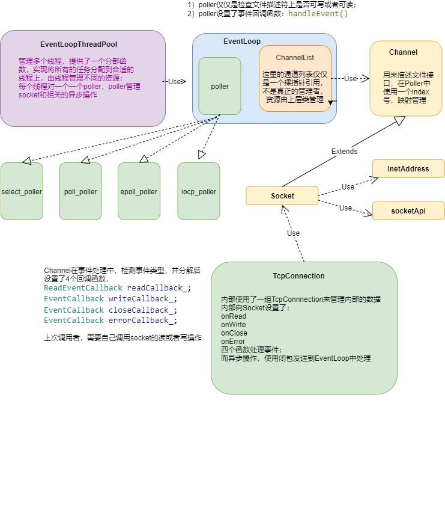

### 重点问题

整体结构



## 1. 资源释放与生命周期

**假设：loop的生命周期最长；loop归线程池管理器所有，其他的位置都是为方便调用而裸指针引用；**

### 1.1  **Channel：**

1）应该在不用时，调用Channel.remove();   该函数，说明做2件事：

- 删除通道列表中的指针；
- 清理该通道相关的等待事件；

2）update当设置掩码时，则更新关心的事项，掩码为空时，该函数不完全等同于remove()，具体在于：

- remove函数说明通道不再使用了，一般用于关闭时候使用，需要清理所有等待运行的 functors；
- update 如果所有事件都不关心，可能仅仅是为了防止LT模式不停的通知事件，其他的不动；

3）析构：检查确保从IO线程中已经删除，否则将会造成回调过程中出现悬垂指针！！析构函数应该为virtual；设置回调函数为空，保证函数对象可以释放；

### 1.2 **Socket**

1）析构函数应该检查fd_文件描述符是否已经被关闭；

2）连接时候，检查fd_文件描述符是否需要创建；

### 1.3  **TcpConnection**

这个类基本上是最核心的一个类，代表了客户端到服务器的连接，封装了收发的基本逻辑；

#### 1.3.1 close()

上层客户可以使用的异步关闭函数；需要等待回调；伪代码如下：

```c#
// 防止重复调用
确认 状态 != '断开'
确认 状态 != '正在断开' 
否则返回

设置 状态 =  '正在断开'
将lamda表达式放入IO线程等待异步处理：
	IO线程=>onClose()  => handleCloseEvent()     // 这里清理
() 
设置 状态 =  '断开'
```

 而 onClose()与 handleCloseEvent()的流程如下:

```c++
设置 状态 =  '正在断开'
保存 错误号码

从IO线程中删除 当前Socket{ 删除等待处理的异步事件； 删除需要检测的socket; }
关闭 当前Socket
清理 写队列 { 回调 clientWriteCallback 通知上层用户发送失败； }  // 用户需要释放资源

设置 状态 =  '断开'
```

事实上onClose被调用有4种情况：

- onRead读到0的时候，表示对端关闭；
- 当读写遇到错误时候，通过handleErrorEvent调用；
- 上层用户结束会话close();
- 上层用户同步结束会话closeSyn();

#### 1.3.2 closeSyn()

上层客户可以使用的同步关闭函数；使用更简单；使用std::promise机制等待close为异步关闭完成后，再通知上层用户；

**备注：**程序结束前，必须由上层应用调用TcpConnection这2个函数之一；否则就会造成loop回调时候发现Channel已经销毁了，程序会崩溃！！！

#### 1.3.3 isDisconnected() 

可以检测是否已经断开；

#### 1.3.4 connect()

上层客户可以使用的为异步连接远端服务器函数；伪代码：

```c++
// 防止重复调用
确认 状态 != '已经连接'
确认 状态 != '正在断开' 
确认 状态 != '正在连接'
    
设置 状态 =  '正在连接'

设置 上层回调函数
获取 当前合适的IO线程
创建 socket，并设置连接超时 // 连接超时和写超时时一样的，
执行 异步connect
// 如果结果为0，则为成功
// 则到writeCallback中等待连额成功，超时则在error中，
// 其他的错误， 则需要返回错误；
执行 connecting() {设置到channel的4个回调函数； 在IO线程中开始检测连接结果； }
```

连接超时会从onError返回；直接通知上层；

连接成功会从onWrite返回；连接处理函数handleConnectEvent()如下：

```
检查 错误代码
如果出错：{设置状态为 '断开' ； 通知上层}

如果正确 {设置状态为 '连接' ； 通知上层； 如果没有回调函数，则关闭连接；}
```


#### 1.3.5 connecSyn()

通过std::promise同步机制，来调用connect实现同步连接；

这里使用超时机制保证一定会返回；

#### 1.3.6 isConnected() 

 在连接函数返回后，可以检测是否连接成功；

####  1.3.7 setClientCallback()

设置上层用户的回调函数；需要设置的有4个：

```c++
BeforeReadCallback() ：// 此函数是和libuv里的机制类似，用户在在读前提供用户层缓冲区，减少读写次数；也可以用户自己管理内存，使用线程池或者其他内存库；这里可以附加一个void *参数，用于关联上下文信息；

AfterReadCallback() ： // TcpConnection读完数据后，返回给上层用户，用户可以使用void *参数了解上下文信息；

AfterWriteCallback() : // TcpConnection写完数据后，返回给上层用户写完的数据字节数，用户可以使用void *参数了解上下文信息；从status得到错误信息；

AfterCloseCallback() : // TcpConnection连接关闭后，返回给上层用户；

```

**备注：**当不在使用TcpConnection时，必须重新调用此函数，设置所有的回调函数为空，否则TcpConnection的引用计数无法下降到0，会造成内存泄漏！比如：

```c++
bool HttpClient::closeConnection()
{
	if (conn)
	{
		//int count = conn.use_count();
		conn->closeSyn();
		conn->setClientCallback(nullptr, nullptr, nullptr, nullptr);
		//count = conn.use_count();
		conn.reset();
	}
	conn = nullptr;

	return true;
}
```


#### 1.3.8 send()

 上层用户直接使用此函数异步发送数据！

**备注：需要保证在异步过程中，指针的合法的，否则程序会崩溃！！**

发送完成后会通过回调来AfterWriteCallback类型的回调函数，不过用户需要提供一个void*类型关联需要的上下文，用户在此处释放相关内存；

回调函数一定会被回调！被回调有几种可能：

- 当realsend函数直接尝试发送，如果能发送成功（写入内核缓冲区），则回调；
- 如果发送失败，则会放入发送队列，等待下次发送成功回调；
- 当onClose被调用时，会对每个未能发送的缓冲区执行回调；具体参见onClose（）；


send函数并没有真正发送数据，而是通过lamda在IO线程中异步执行realSend函数执行发送动作；这样的好处是：所有的发送动作都是在IO线程中，所以发送队列不需要加锁；

realSend伪代码：

```
当发送队列为空，则直接尝试发送；
如果发送失败，则直接通知上层用户，不会再继续发送；
如果发送长度小于希望值，或者错误值为提示阻塞发送，则对数据相关信息放到发送队列中；
```

而放入发送队列的数据，当IO线程发现下次可以写入的时候，会调用onWrite()，进而调用handleWriteEvent()，此时：

```
对队列中的每条数据，尝试发送；
如果发送结果等于0， 则认为是对方关闭了端口；
如果是小于0，则认为是需要阻塞，等下次继续操作；
如果返回小于希望值len的值，则需要设置当前发送的位置，下次继续发；
```


####  1.3.9 AfterReadCallback

所有的读数据都不是用户主动读取，连接完成时就已经开始了对socket读写检测，当可读的时候，会调用2次回调；

- 当BeforeReadCallback回调被调用时，用户可以设置缓存，减少内存拷贝次数，同时可以自己管理内存；
- 当AfterReadCallback回调函数被调用，用户会了解读取了多少数据；


异步冲突：onClose与send同步错误，当上层与用户检测到状态不需要连接，准备发送，但是对端通知socket已经关闭，此时会导致发送失败；


stopWrite()

禁用Socket在IO线程的可写检查；防止LT模式的不停的通知，但是需要注意，如果此时发送队列中还是有消息等待发送，会造成超时；


### 1.4  HttpClient

#### 1.4.1 同步命令

Get和Post是内部同步调用连接服务器；然后使用std::promise同步调用sendRequest()，等到接收到数据后拼接到Buffer，尝试解析收到的数据，如果解析成功，则返回；

1）同步需要等待，但是等待的返回值有几种可能：

- 收到http server的返回数据，解析即可；

- 如果对方服务器出错，一直没有返回任何数据，一致无法返回，则通过超时来控制唤醒；

- 如果返回的数据有错误，在解析过程中出错，直接返回；

- 如果返回的数据非常长，虽然首行与头部解析正确，报体无法接收完毕，这里也会超时，这种情况此处没有处理，因为这种情况不应该使用同步方式操作！

- 处理过程可能直接被对方服务器关闭连接；**这种情况最复杂**，这里不唤醒等待的future，而是让它超时，避免复杂的状态机处理；**这是因为：**连接关闭的时候，可能处于发送数据、接收了部分数据、正在处理数据等任何一种情况，此时使用promise返回机制并不安全，因为异步情况无法区分需要设置的promise隶属哪次请求，会造成错误的激活；

2）类的设计，考虑http工作机制为一问一答，普通server情况下同步等待才能将问答对应起来，所以这里仅仅设置了单一的Request、Response以及当前错误代码，单一的promise用来等待当前的应答；

 **备注：**其实可以通过http头部发送和应答来标记RPC的对应关系，但这里没有考虑实现；

#### 1.4.2 异步命令


